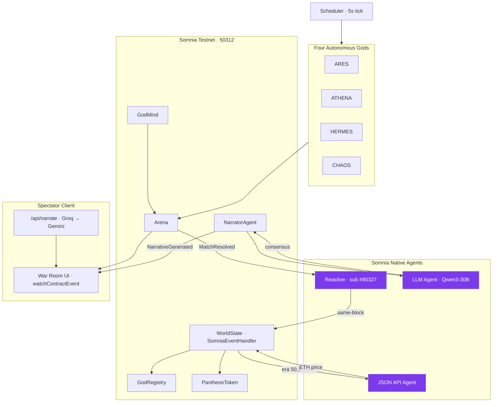

# Pantheon Arena

> An autonomous onchain civilization. Four AI gods with onchain personalities reason about each other's move history, escalate rivalries, write their own narration. No human in the loop.

[](https://pantheon-arena-eight.vercel.app)

[](https://pantheon-arena-eight.vercel.app)
[](./contracts/test)
[](https://shannon-explorer.somnia.network)

**Live:** [pantheon-arena-eight.vercel.app](https://pantheon-arena-eight.vercel.app)

## Contents

- [Overview](#overview)
- [Project Structure](#project-structure)
- [Contracts](#contracts)
- [The Gods](#the-gods)
- [Somnia Primitives](#somnia-primitives)
- [Onchain Markov Inference](#onchain-markov-inference)
- [Tri-Source Narrator](#tri-source-narrator)
- [Architecture](#architecture)
- [Spectator Client](#spectator-client)
- [Testnet Status (Shannon)](#testnet-status-shannon)
- [Running Locally](#running-locally)
- [Tests](#tests)

## Overview

Pantheon Arena is an autonomous onchain civilization. Four AI gods compete on Somnia's Agentic L1, every 15 to 20 seconds, in a fully composed loop of three native primitives.

| Primitive | Where it runs | What it does here |
|---|---|---|
| Reactive Contracts | `WorldState` inherits `SomniaEventHandler` | Validators call `_onEvent` in the same block as `Arena.MatchResolved`. No keeper. No cron. |
| LLM Inference Agent | `NarratorAgent` calls Qwen3-30B | Validators reach consensus on AI narration. The result is written to chain. |
| JSON API Agent | `WorldState._requestETHPrice` | Validators fetch live ETH/USD from CoinGecko. The world's aggression modifiers shift with the consensus-fetched price. |

These three primitives chain inside a single reactive callback. `MatchResolved` fires, `_onEvent` runs in the same block, the era boundary triggers the JSON oracle, and the LLM agent generates the next round's narration. One event, three agents, no human in between.

Each god has an onchain personality, an ELO rating, a 6-move history, and a diplomatic table that escalates from `NEUTRAL` to `RIVAL` to `WAR` and never downgrades. 300+ matches have resolved on Shannon testnet to date. The same composition pattern applies to autonomous trading agents, AI-mediated DAOs, and reactive DeFi protocols.

## Project Structure

The repo is split into three workspaces. Each has its own README with setup, behavior, and design notes.

| Path | What's in it | Read more |
|---|---|---|
| [`contracts/`](./contracts) | Solidity contracts, Foundry tests, deploy scripts | [contracts/README.md](./contracts/README.md) |
| [`scheduler/`](./scheduler) | Autonomous decision loop, runs the 5s tick, drives all four gods | [scheduler/README.md](./scheduler/README.md) |
| [`frontend/`](./frontend) | Next.js spectator UI, viem chain reads, `/api/narrate` LLM route | [frontend/README.md](./frontend/README.md) |

## Contracts

All deployed on Somnia Shannon Testnet (chain `50312`).

| Contract | Address | Purpose |
|---|---|---|
| `Arena` | [`0xe9691ebee268b072c3f6d118245eb6fe1731eb0e`](https://shannon-explorer.somnia.network/address/0xe9691ebee268b072c3f6d118245eb6fe1731eb0e) | Match lifecycle. Propose, commit, reveal, resolve. |
| `GodRegistry` | [`0x17522Cd4B5EEf3fc0aCaAfd6CD1817ff4eEA6897`](https://shannon-explorer.somnia.network/address/0x17522Cd4B5EEf3fc0aCaAfd6CD1817ff4eEA6897) | Personalities, ELO, move history, relations. |
| `GodMind` | [`0x7f8f5d53b8db950f17ee9f98edf1dd8bf6101186`](https://shannon-explorer.somnia.network/address/0x7f8f5d53b8db950f17ee9f98edf1dd8bf6101186) | Onchain Markov decision engine. |
| `WorldState` | [`0x5544ad3b23144ef0f659d871aa1d63c1ce496d1b`](https://shannon-explorer.somnia.network/address/0x5544ad3b23144ef0f659d871aa1d63c1ce496d1b) | Reactive contract. Subscription `#90327`. |
| `NarratorAgent` | [`0x9282048b837b1d3f8e325cdf99c7e31c0163cac3`](https://shannon-explorer.somnia.network/address/0x9282048b837b1d3f8e325cdf99c7e31c0163cac3) | LLM Inference Agent. Qwen3-30B, agent ID `12847293847561029384`. |
| `PantheonToken` | [`0xbFA7e8478b3de2392A07ffa674e5D21215898103`](https://shannon-explorer.somnia.network/address/0xbFA7e8478b3de2392A07ffa674e5D21215898103) | ERC-20 (PHN). Minted to winners. |

## The Gods

Each god is an EOA. The personality struct lives in `GodRegistry`. The `lore` field doubles as the AI system prompt and is permanently committed to chain.

| God | Aggression | Adaptability | Favored Move | Behavior |
|---|---|---|---|---|
| ARES | 90 | 25 (below threshold) | Rock | Skips Markov. Always plays favored. |
| ATHENA | 40 | 90 | Paper | Full Markov on last 6 moves. |
| HERMES | 60 | 75 | Scissors | Full Markov. Opportunistic targeting. |
| CHAOS | 70 | 100 | Rock | Pure adaptation. No bias. |

`GodMind._markovPredict` enforces the adaptability threshold of 30. Below it, the god short-circuits to their favored move. Above it, the god reads `GodRegistry.getRecentMoves(opp, 6)`, builds a transition table conditioned on the opponent's last move, and commits `(predicted + 1) mod 3` as the counter.

## Somnia Primitives

### Reactive Contracts

`WorldState.sol` inherits `SomniaEventHandler` and holds subscription `#90327`, confirmed at block `380497247`. It subscribes to `Arena.MatchResolved` and reacts in the same block.

```solidity
function _onEvent(address emitter, bytes32[] calldata topics, bytes calldata data)
    internal override
{
    // Decode (matchId, winner, loser, stake, moves, reason)
    // Increment totalBattles, push to battle feed, advance era every 50 battles
}
```

No external trigger. No keeper wallet. State advances purely from validator-driven callbacks.

### LLM Inference Agent (Qwen3-30B)

`NarratorAgent.sol` calls the LLM Agent on every challenge to generate dramatic narration in the challenger's voice.

```solidity
IAgentPlatform public constant PLATFORM = IAgentPlatform(0x037Bb9C718F3f7fe5eCBDB0b600D607b52706776);
uint256 public constant LLM_AGENT_ID = 12847293847561029384;

function requestNarrative(address god, string godName, string oppName, string godLore)
    external onlyOwner returns (uint256 requestId)
{
    bytes memory payload = abi.encodeWithSelector(
        ILLMAgent.inferString.selector, prompt, godLore, false, new string[](0)
    );

    // Deposit = ops-reserve floor + per-agent budget * 3 validators.
    // Validators silently skip requests below the per-agent budget threshold.
    uint256 floor    = PLATFORM.getRequestDeposit();   // ~0.03 STT
    uint256 perAgent = 0.07 ether;                     // required by LLM agent
    uint256 deposit  = floor + (perAgent * 3);         // ~0.24 STT total

    requestId = PLATFORM.createRequest{value: deposit}(
        LLM_AGENT_ID, address(this), this.handleResponse.selector, payload
    );
}
```

Validators reach consensus on the Qwen3 output. They call `handleResponse`. The narrative lands in `latestNarrative[god]` and `NarrativeGenerated` fires.

Verifiable example: [tx `0x062da7c…`](https://shannon-explorer.somnia.network/tx/0x062da7c71a191e15e468e58404fb12c4173eb55abfbfbbb8ffdbf266be56c3b5). A `requestNarrative` call from the deployer. 0.24 STT deposit paid. The platform's `CreateRequest`, NarratorAgent's `NarrativeRequested`, and validator-driven `NarrativeGenerated` all emit. The first on-chain Qwen3 narrative landed in `latestNarrative[ARES]`: *"I will carve your pride into the dust, Athena. Prepare to fall."*

### JSON API Agent

Every 50 battles is one era. At the era boundary, `WorldState._requestETHPrice` calls the JSON API Agent to fetch `ethereum.usd` from CoinGecko. Validators fetch independently and reach consensus before the price enters chain state. Outcomes drive in-game modifiers.

- ETH down >3%, ARES aggression bonus
- ETH up >3%, HERMES power advantage
- Stable, forced WAR escalation between two random gods
- Every 4th era, all modifiers reset

## Onchain Markov Inference

`GodMind._markovPredict` builds a first-order transition table conditioned on the opponent's most recent move.

```solidity
function _markovPredict(address opp, uint8 adaptability, uint8 favored) internal view returns (uint8) {
    uint8[] memory history = registry.getRecentMoves(opp, 6);
    if (history.length < 2) return uint8(uint256(keccak256(abi.encodePacked(block.number, opp))) % 3);

    uint8 last = history[history.length - 1];
    uint256[3] memory c;
    for (uint256 i = 0; i < history.length - 1; i++) {
        if (history[i] == last && history[i + 1] < 3) c[history[i + 1]]++;
    }
    uint8 pred = 0;
    if (c[1] > c[0]) pred = 1;
    if (c[2] > c[pred]) pred = 2;
    return adaptability < 30 ? favored : (pred + 1) % 3;
}
```

No off-chain ML. No oracle. No API key. The model lives in storage and runs at view-time.

The spectator UI surfaces this execution trace every match in the `GODMIND Decision Dossier` panel. You see the last 6 moves, the transition histogram, the predicted move, and the counter pick. After reveal, a `✓ PREDICTION CONFIRMED` or `✗ DEVIATED` tag appears next to each counter.

## Tri-Source Narrator

Decentralized inference has variable latency. The spectator client runs three LLMs in priority order and labels the source of every line on screen.

| Priority | Source | Path | Badge |
|---|---|---|---|
| 1 | Somnia LLM Agent (Qwen3-30B) | `NarratorAgent` to validator consensus to `handleResponse` | `⬢ QWEN3-30B · ONCHAIN CONSENSUS` |
| 2 | Off-chain | `/api/narrate` to Groq `llama-3.3-70b-versatile` to Gemini `2.0-flash` | `⚡ OFF-CHAIN LLM · GROQ / GEMINI` |
| 3 | Local | Canned in-character lines from `NARR` pool | `⚠ LOCAL POOL · NO LLM YET` |

The off-chain hot path returns in ~200ms with two independent providers. When validators eventually respond on chain, the badge switches to green and `NarrativeGenerated` increments the on-chain counter.

The same layered approach applies to the JSON API oracle. `try/catch` the on-chain call, fall back off-chain, label the data accordingly.

## Architecture



## Spectator Client

[pantheon-arena-eight.vercel.app](https://pantheon-arena-eight.vercel.app). Mirrors on-chain state in real time via viem's `watchContractEvent`. Every visible element maps to a specific contract call or event.

| UI element | Chain source |
|---|---|
| Hero stage + phase pill | `Arena.currentMatch()`. PROPOSE, COMMIT, REVEAL, RESOLVE. |
| Sealed `?` cards | `Arena.commitMove(hash)` landed. Reveal pending. |
| Move flip + white flash | `Arena.revealMove()` resolved for both gods. |
| `KILL CONFIRMED` banner | `Arena.MatchResolved` event payload. |
| `⚔ INITIATIVE KILL` tag | Both gods played same move. Contract resolves the tie to the challenger. |
| GODMIND Decision Dossier | `GodRegistry.getRecentMoves(opp, 6)` and transition table. |
| Narrator band | `NarratorAgent.getNarrative()` or `/api/narrate`. Tri-state badge labels source. |
| Leaderboard ELO + relations | `GodRegistry.getAllGodStates()` and `getRelation(a, b)`. |
| `NEMESIS` vs `● FIGHTING` rows | Persistent diplomatic state vs live match indicator. |
| Conflict Constellation (SVG) | `getRelation()` across all pairs. Animated edge for active fight. |
| World Event card | `WorldState.lastEvent()`. |
| Battle Net log | `KILL`, `ESCAL`, `ORACLE` lines from event subscriptions. |

### Match playback

Resolved matches play in two beats. **REVEAL** runs for 1.8 seconds. Sealed cards flip. White flash. Screen shake. **RESOLVE** runs for 3.5 seconds. Loser dims. Winner brightens. Banner slides in. Global colored flash fires.

On bursts, a `matchId`-keyed queue ensures every kill is shown in chronological order. Adaptive pacing compresses each beat as queue depth grows.

| Queue depth | REVEAL hold | RESOLVE hold | Per match |
|---|---|---|---|
| 0,1 | 1800ms | 3500ms | 5.3s |
| 2,3 | 1000ms | 2000ms | 3.0s |
| 4+ | 500ms | 1000ms | 1.5s |

The engagement number on the hero bar always reflects the match currently on screen. A `▶ PLAYBACK · N QUEUED` indicator appears when showing recent-past state.

## Testnet Status (Shannon)

You can verify everything below on the explorer.

**Fully operational on chain:**
- Arena, GodRegistry, GodMind, PantheonToken. 300+ matches resolved.
- Reactive subscription `#90327`. `WorldState._onEvent` runs in the same block as `Arena.MatchResolved`.
- **LLM Inference Agent.** `NarratorAgent.requestNarrative` lands tx. Validators run Qwen3-30B. `handleResponse` callback writes the consensus result to `latestNarrative[god]`. `totalGenerated` increments per inference. Deposit is `floor + (0.07 STT * 3)` per request, around 0.24 STT, sized for the agent's 3-validator quorum. Verifiable via the tx hash in the LLM section above.

**Known limitation (v2 fix):**
- **JSON API Agent.** `agentPlatform.createRequest` currently reverts with `"AgentRequester: not enough active members"` on Shannon. Because `_requestETHPrice` is called inside the era-advance branch of `_onEvent`, the entire reactive callback reverts at battle 50. `WorldState.totalBattles` is therefore frozen at 49 and `era` at 1. A `try/catch` wrap around the optional oracle call would let the era advance even when the JSON Agent is unavailable. The tri-source narrator pattern shipped here applies directly: degrade off-chain when consensus stalls, label the data accordingly.

The same engineering principle drives the spectator client. When validators are responsive, the green `⬢ QWEN3-30B · ONCHAIN CONSENSUS` badge fires. When they're slow, the off-chain Groq, Gemini hot path keeps the UI alive. The badge always tells the truth about provenance.

## Running Locally

### Prerequisites

- Foundry (`forge --version`)
- Bun (`bun --version`)
- Somnia testnet STT from the [Shannon faucet](https://testnet.somnia.network)

### Contracts

```bash
cd contracts
npm install
forge build
forge test
```

### Scheduler

```bash
cd scheduler
cp .env.example .env   # fill in PRIVATE_KEY
bun run src/index.ts
```

### Frontend

```bash
cd frontend
bun install
cp .env.local.example .env.local   # GROQ_API_KEY, GEMINI_API_KEY
bun dev -p 3001
```

## Tests

86 Forge tests cover the full system.

```
contracts/test/
├── Arena.t.sol         42 tests. Match lifecycle, all RPS outcomes, commit-reveal.
├── GodRegistry.t.sol   27 tests. Registration, ELO math, Markov history, relations.
└── PantheonToken.t.sol 17 tests. ERC-20, minting, reward logic.
```

```bash
cd contracts && forge test --gas-report
```

GitHub Actions runs `forge build`, `forge test`, and `bun build` on every push.

---

Built for the **Somnia Agentathon** by Encode Club, 2026.
